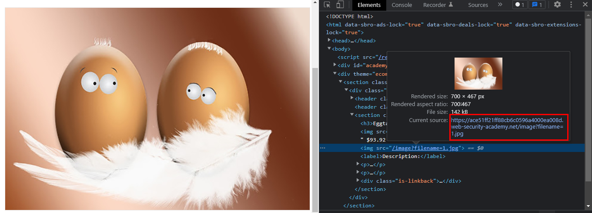
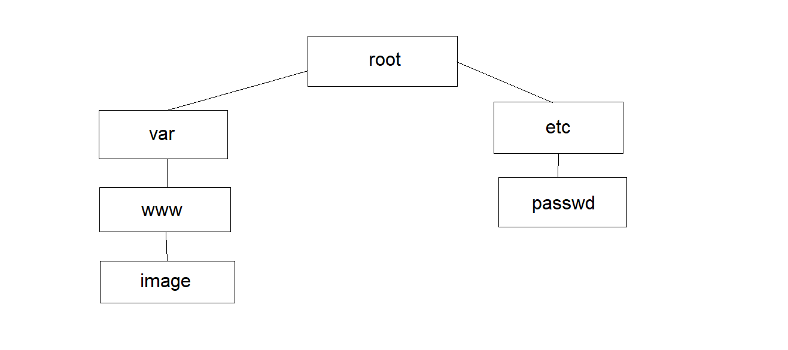

# Lab: File path traversal, simple case

> Phòng thí nghiệm này chứa lỗ hổng path traversal trong việc hiển thị hình ảnh sản phẩm. Để giải quyết phòng thí nghiệm, hãy truy xuất nội dung của tệp / etc / passwd.

Chọn 1 bức ảnh may mắn để lấy đường dẫn hiển thị hình ảnh sản phẩm.

>

Dễ thấy được path dẫn ảnh ở đây là `/image?filename=1.jpg`. Trong hệ điều hành Linux thì các hình ảnh được lưu trong thư mục `/var/www/image` còn file password được lưu trong thư mục `/etc/passwd`. 

>

Chỉnh sửa path thành `/image?filename=../../../etc/passwd`. Ở đây `../../../` để trở về từ folder image về root và tiếp tục đi thẳng tới `etc/passwd`